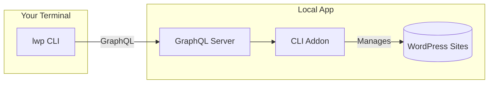

# Local CLI

[](https://github.com/jpollock/local-addon-cli/actions/workflows/ci.yml)
[](https://www.npmjs.com/package/@local-labs-jpollock/local-cli)
[](https://opensource.org/licenses/MIT)

Command-line interface for [Local](https://localwp.com) WordPress development.

## Architecture



## Installation

```bash
npm install -g @local-labs-jpollock/local-cli
```

### AI Assistant Integration (Claude Code)

```bash
lwp skill install
```

This installs a Claude Code skill so AI assistants can manage your Local sites.

## Quick Start

```bash
# List all sites
lwp sites list

# Start a site
lwp sites start my-blog

# Run WP-CLI commands
lwp wp my-blog plugin list

# Export database
lwp db export my-blog

# Push to WP Engine
lwp wpe push my-blog
```

## Features

- **Site Management**: Create, start, stop, delete, clone, export/import sites
- **WP-CLI Integration**: Run any WP-CLI command against your sites
- **Database Operations**: Export, import, open Adminer
- **Cloud Backups**: Create, restore, list backups (Dropbox, Google Drive)
- **WP Engine Sync**: Push/pull sites to/from WP Engine
- **Blueprints**: Save and reuse site configurations

## Requirements

- [Local](https://localwp.com) must be installed and running
- Node.js 18+

## Documentation

- [CLI Usage Guide](docs/CLI-USAGE.md) - Full command reference
- [AI Assistant Context](docs/AI-CONTEXT.md) - For AI coding assistants

## Command Reference

### Sites

| Command | Description |
|---------|-------------|
| `lwp sites list` | List all sites |
| `lwp sites list --size` | List with disk usage |
| `lwp sites list --status running` | Filter by status |
| `lwp sites get <site>` | Get site details |
| `lwp sites start <site>` | Start a site |
| `lwp sites stop <site>` | Stop a site |
| `lwp sites restart <site>` | Restart a site |
| `lwp sites create <name>` | Create a new site |
| `lwp sites delete <site>` | Delete a site |
| `lwp sites clone <site> <newName>` | Clone a site |
| `lwp sites export <site>` | Export to zip |
| `lwp sites import <zipFile>` | Import from zip |
| `lwp sites open <site>` | Open in browser |
| `lwp sites ssl <site>` | Trust SSL certificate |
| `lwp sites php <site> <version>` | Change PHP version |
| `lwp sites xdebug <site>` | Toggle Xdebug |
| `lwp sites logs <site>` | View site logs |
| `lwp sites rename <site> <newName>` | Rename a site |

### WP-CLI

```bash
lwp wp <site> <command...>

# Examples
lwp wp my-blog plugin list
lwp wp my-blog option get siteurl
lwp wp my-blog user list --format=json
```

### Database

| Command | Description |
|---------|-------------|
| `lwp db export <site>` | Export database to SQL |
| `lwp db import <site> <sqlFile>` | Import SQL file |
| `lwp db adminer <site>` | Open Adminer UI |

### Backups

| Command | Description |
|---------|-------------|
| `lwp backups status` | Check backup service status |
| `lwp backups list <site>` | List backups |
| `lwp backups create <site>` | Create backup |
| `lwp backups restore <site> <id>` | Restore backup |
| `lwp backups delete <site> <id>` | Delete backup |

### WP Engine

| Command | Description |
|---------|-------------|
| `lwp wpe status` | Check WPE connection |
| `lwp wpe login` | Authenticate with WPE |
| `lwp wpe logout` | Logout from WPE |
| `lwp wpe sites` | List WPE sites |
| `lwp wpe link <site>` | Show WPE connection |
| `lwp wpe push <site>` | Push to WPE |
| `lwp wpe pull <site>` | Pull from WPE |
| `lwp wpe history <site>` | View sync history |
| `lwp wpe diff <site>` | Show file differences |

### Blueprints

| Command | Description |
|---------|-------------|
| `lwp blueprints list` | List blueprints |
| `lwp blueprints save <site> <name>` | Save as blueprint |

### Services

| Command | Description |
|---------|-------------|
| `lwp services list` | List available services |

### System

| Command | Description |
|---------|-------------|
| `lwp info` | Show Local app info |
| `lwp update` | Update CLI to latest version |
| `lwp analytics show` | Show analytics status |
| `lwp skill install` | Install Claude Code skill |

## Global Options

| Option | Description |
|--------|-------------|
| `--json` | Output in JSON format |
| `--quiet` | Minimal output |
| `--no-color` | Disable colors |

## Development

```bash
# Clone the repository
git clone https://github.com/jpollock/local-addon-cli.git
cd local-addon-cli

# Install dependencies
npm install

# Build
npm run build

# Run tests
npm test

# Run E2E tests (requires Local running)
npm run test:e2e -w packages/cli
```

## License

MIT License - see [LICENSE](LICENSE) for details.
