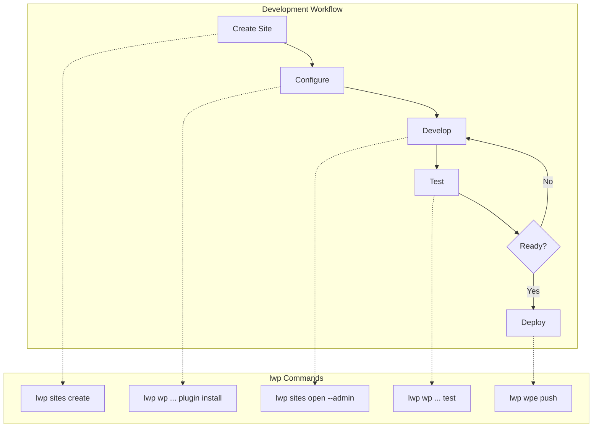

# AI Assistant Context for Local CLI

This document provides context for AI coding assistants working with the Local CLI (`lwp`).

## Overview

Local CLI (`lwp`) is a command-line interface for [Local](https://localwp.com), a WordPress local development environment. The CLI communicates with a running Local application via GraphQL.



## Prerequisites

- Local application must be installed and running
- The CLI addon is auto-installed on first use
- Sites are managed through Local's GUI or CLI

## Command Structure

```
lwp <command-group> <action> [arguments] [options]
```

### Command Groups

| Group | Purpose |
|-------|---------|
| `sites` | Site lifecycle management |
| `wp` | WordPress CLI (WP-CLI) commands |
| `db` | Database operations |
| `backups` | Cloud backup management |
| `wpe` | WP Engine synchronization |
| `blueprints` | Site templates |
| `services` | Lightning Services info |

## Common Workflows

### 1. Create and Configure a New Site

```bash
# Create site with defaults
lwp sites create my-project

# Or with specific configuration
lwp sites create my-project --php 8.2.10 --blueprint starter

# Start the site
lwp sites start my-project

# Open in browser
lwp sites open my-project
```

### 2. Develop with WP-CLI

```bash
# Install and activate plugins
lwp wp my-project plugin install woocommerce --activate
lwp wp my-project plugin install query-monitor --activate

# Install theme
lwp wp my-project theme install flavor --activate

# Update WordPress options
lwp wp my-project option update blogname "My Project"

# Create test user
lwp wp my-project user create editor editor@test.local --role=editor
```

### 3. Database Management

```bash
# Export database for backup
lwp db export my-project -o ~/backups/my-project.sql

# Run SQL query
lwp wp my-project db query "SELECT option_name FROM wp_options LIMIT 10"

# Search and replace (dry run first)
lwp wp my-project search-replace 'old.local' 'new.local' --dry-run
lwp wp my-project search-replace 'old.local' 'new.local'
```

### 4. Deploy to WP Engine

```bash
# Authenticate (opens browser)
lwp wpe login

# Check connection
lwp wpe status

# View linked installs
lwp wpe link my-project

# Push files and database
lwp wpe push my-project --sql

# Pull from production
lwp wpe pull my-project --sql
```

### 5. Backup and Restore

```bash
# Create cloud backup
lwp backups create my-project --note "Before major update"

# List backups
lwp backups list my-project

# Restore from backup
lwp backups restore my-project <snapshot-id>
```

## Site Identification

Sites can be identified by:
- **Name**: Human-readable name (e.g., `my-blog`)
- **ID**: Unique identifier from Local

Use `lwp sites list --json` to get both identifiers.

## Output Formats

| Option | Use Case |
|--------|----------|
| (default) | Human-readable tables |
| `--json` | Machine parsing, scripting |
| `--quiet` | Just names/IDs for piping |

### JSON Output for Scripting

```bash
# Get site URL programmatically
lwp sites get my-project --json | jq -r '.url'

# List all site names
lwp sites list --json | jq -r '.[].name'

# Check site status
lwp sites get my-project --json | jq -r '.status'
```

## Error Handling

### Common Errors and Solutions

| Error | Cause | Solution |
|-------|-------|----------|
| `Local is not installed` | Local app not found | Install from localwp.com |
| `Timed out waiting for Local` | Local not running | Start Local application |
| `Site not found` | Invalid site name/ID | Check with `lwp sites list` |
| `Not authenticated with WP Engine` | No WPE auth | Run `lwp wpe login` |

### Exit Codes

- `0`: Success
- `1`: Error (check stderr)

### Debugging

```bash
# View PHP error log
lwp sites logs my-project -t php -n 100

# View nginx access log
lwp sites logs my-project -t nginx

# View MySQL log
lwp sites logs my-project -t mysql
```

## WP-CLI Integration

The CLI wraps WP-CLI, providing full access to WordPress management:

```bash
lwp wp <site> <wp-cli-command>
```

### Useful WP-CLI Commands

```bash
# Core
lwp wp my-site core version
lwp wp my-site core update

# Plugins
lwp wp my-site plugin list --status=active
lwp wp my-site plugin install <plugin> --activate
lwp wp my-site plugin deactivate --all

# Database
lwp wp my-site db optimize
lwp wp my-site db repair

# Cache
lwp wp my-site cache flush
lwp wp my-site transient delete --all

# Options
lwp wp my-site option list --search="siteurl"
lwp wp my-site option get home

# Users
lwp wp my-site user list --role=administrator
lwp wp my-site user update 1 --user_pass=newpassword

# Posts
lwp wp my-site post list --post_type=page
lwp wp my-site post delete $(lwp wp my-site post list --post_type=revision --format=ids)

# Maintenance
lwp wp my-site rewrite flush
lwp wp my-site cron event run --due-now
```

## WordPress Context

When assisting with WordPress development:

### File Locations

Sites are stored in Local's sites directory:
- macOS: `~/Local Sites/<site-name>/`
- Windows: `C:\Users\<user>\Local Sites\<site-name>\`
- Linux: `~/Local Sites/<site-name>/`

Within each site:
- `app/public/` - WordPress installation
- `app/public/wp-content/themes/` - Themes
- `app/public/wp-content/plugins/` - Plugins
- `app/public/wp-content/uploads/` - Media files
- `conf/` - Server configuration
- `logs/` - PHP, nginx, MySQL logs

### Database Access

```bash
# Direct SQL via WP-CLI
lwp wp my-site db query "SHOW TABLES"

# Open Adminer (web UI)
lwp db adminer my-site

# Export for external tool
lwp db export my-site -o ~/database.sql
```

### PHP Configuration

```bash
# Change PHP version
lwp sites php my-site 8.2.10

# Enable Xdebug for debugging
lwp sites xdebug my-site --on
```

## Best Practices for AI Assistants

1. **Check site status first**: Use `lwp sites get <site> --json` before running commands
2. **Use JSON output**: Parse JSON for reliable data extraction
3. **Validate site names**: Confirm site exists with `lwp sites list`
4. **Dry-run destructive operations**: Use `--dry-run` for search-replace
5. **Export before import**: Always backup database before importing
6. **Start sites before WP-CLI**: Ensure site is running for WP-CLI commands

## Quick Reference

```bash
# Site lifecycle
lwp sites list                     # List all sites
lwp sites create <name>            # Create site
lwp sites start <site>             # Start site
lwp sites stop <site>              # Stop site
lwp sites delete <site>            # Delete site

# WordPress management
lwp wp <site> plugin list          # List plugins
lwp wp <site> theme list           # List themes
lwp wp <site> option get siteurl   # Get option

# Database
lwp db export <site>               # Export SQL
lwp db import <site> <file>        # Import SQL

# Development
lwp sites xdebug <site> --on       # Enable debugging
lwp sites logs <site>              # View logs
lwp sites open <site> --admin      # Open WP Admin
```
